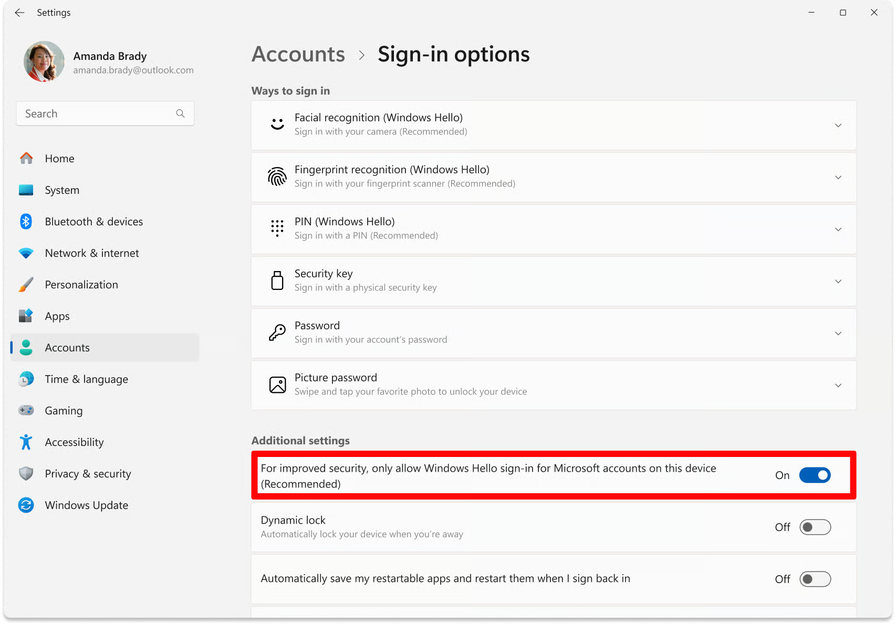

# Hyper V / Pin Error



### <mark style="color:blue;">Open windows search and type “Sign-in Options”, then open it in settings.</mark>

Find the setting below and make sure it is disabled.

<figure><figcaption></figcaption></figure>




### <mark style="color:blue;">Click on PIN (Windows Hello</mark>

ensure it is NOT SET, if it is, then remove your PIN and make sure a password is set.




### <mark style="color:blue;">Download & run Hyper-V Remover</mark>

[Hyper-V Remover](https://download.solarservicesdocs.com/remove-hvix-hvax), it will automatically remove Hyper-V. It may reboot your PC several times & on rare occasions require you to press <kbd>F3</kbd> during boot to disable UEFI-level system locks on VBS, so just keep an eye on what the loader is telling you to do, though most systems will just automatically reboot and be done.


